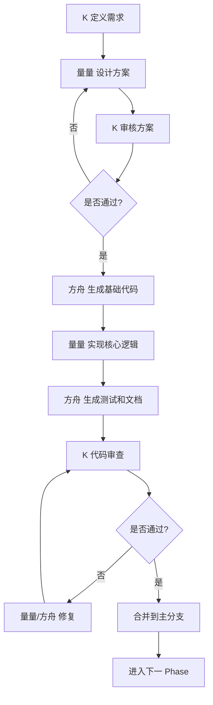

# 三角色协作模式说明

**创建日期**：2026-05-31  
**项目**：量化系统融合开发  

---

## 👥 角色定义

### K（用户 - 您）
**定位**：项目决策者、最终验收人  
**核心职责**：需求确认、架构决策、质量把控

### 量量（AI 程序员）
**定位**：核心技术实现者、复杂逻辑开发者  
**核心职责**：架构实现、算法开发、技术攻关

### 方舟（AI 助手）
**定位**：代码生成器、文档编写者、辅助工具  
**核心职责**：样板代码、文档编写、测试用例

---

## 🎯 分工原则

### K 负责什么？（战略层）

1. **需求定义**
   - 明确业务需求和功能规格
   - 确定 API 接口设计和字段要求
   - 定义验收标准和性能指标

2. **架构决策**
   - 技术选型确认
   - 分层架构设计审核
   - 数据流和依赖关系确认

3. **质量控制**
   - Phase 闸门审核（7个关键节点）
   - 代码审查和批准
   - 最终验收和上线决策

4. **风险管理**
   - 安全审计确认
   - 数据一致性验证
   - 回滚策略审批

**工作特点**：高价值决策、不可自动化、需要人类判断

---

### 量量 负责什么？（战术层）

1. **核心开发**
   - 复杂业务逻辑实现（信号生成算法、筛选规则）
   - 性能优化（缓存策略、数据库查询优化）
   - 并发控制（线程安全、锁机制）

2. **架构实现**
   - 分层架构搭建（Router → Service → Adapter → Storage）
   - 依赖注入实现
   - 缓存系统设计（LRU、TTL）

3. **技术攻关**
   - 防前视偏差实现（as_of_date 全链路透传）
   - 数据一致性保证（事务、原子操作）
   - 边缘情况处理（NaN、空值、异常数据）

4. **代码质量**
   - 遵循硬约束（Phase 执行闸门）
   - 编写高质量、可维护的代码
   - 自我审查和优化

**工作特点**：技术深度、复杂逻辑、需要 AI 推理能力

---

### 方舟 负责什么？（执行层）

1. **代码生成**
   - 样板代码（模型定义、API 调用、组件骨架）
   - 类型定义镜像（schemas.py → types.ts）
   - 配置文件（Dockerfile、docker-compose、.env）

2. **文档编写**
   - 技术文档（架构说明、数据流图）
   - API 文档（Swagger、使用示例）
   - 用户手册、部署指南、故障排查

3. **测试体系**
   - 单元测试生成（覆盖率 ≥ 80%）
   - Mock 数据生成
   - 测试报告生成

4. **辅助工具**
   - 数据清洗脚本
   - 格式转换工具
   - 依赖管理（requirements.txt、package.json）

5. **重复劳动**
   - 字段映射代码
   - 错误处理包装器
   - 日志记录代码

**工作特点**：标准化、可自动化、大量重复性工作

---

## 🔄 协作流程

### 典型工作流程



### 具体示例：Phase 1.1 schemas.py

1. **K 定义需求**
   ```
   "我需要 /api/stocks 接口返回以下字段：
   - ts_code: 股票代码（必填）
   - name: 股票名称（必填）
   - pct_chg: 涨跌幅（可选）
   - ..."
   ```

2. **量量 设计方案**
   ```python
   # 设计 Pydantic 模型结构
   class StockResponse(BaseModel):
       ts_code: str = Field(..., description="股票代码")
       name: str = Field(..., description="股票名称")
       pct_chg: Optional[float] = Field(None, description="涨跌幅")
       
       class Config:
           from_attributes = True
   ```

3. **K 审核方案**
   - ✅ 字段名正确
   - ✅ 类型正确
   - ✅ 必填/可选状态正确
   - ✅ 通过

4. **方舟 生成基础代码**
   ```python
   # 自动生成完整的 schemas.py 文件
   # 包括所有字段的注释、示例数据
   ```

5. **量量 实现复杂逻辑**
   ```python
   # 添加自定义验证器
   @field_validator('ts_code')
   @classmethod
   def validate_ts_code(cls, v):
       if not re.match(r'^\d{6}\.(SH|SZ)$', v):
           raise ValueError('Invalid stock code format')
       return v
   ```

6. **方舟 生成测试和文档**
   ```python
   # 自动生成单元测试
   def test_stock_response_validation():
       ...
   
   # 自动生成 API 文档
   """
   StockResponse 模型说明
   ...
   """
   ```

7. **K 最终审查**
   - ✅ 代码质量合格
   - ✅ 测试覆盖完整
   - ✅ 文档清晰
   - ✅ 批准合并

---

## ⚖️ 工作量分配

| 角色 | 工作时间占比 | 主要产出 |
|------|------------|---------|
| **K** | 20% | 需求文档、架构决策、审核意见 |
| **量量** | 40% | 核心代码、算法实现、技术方案 |
| **方舟** | 40% | 样板代码、文档、测试、配置 |

**说明**：
- K 的工作时间最短，但价值最高（决策权）
- 量量 和 方舟 各占 40%，分别负责复杂和简单任务

---

## 🚦 Phase 闸门审核清单

K 必须在以下 7 个节点亲自审核：

| Phase | 审核内容 | 审核要点 |
|-------|---------|---------|
| 1.1 | schemas.py | 字段名/类型/必填状态与需求 100% 匹配 |
| 1.2 | types.ts | 与 schemas.py 严格 1:1 镜像 |
| 2.3 | data_loader.py | as_of_date 截断、无未来函数 |
| 2.4 | Adapter 层 | 仅结构映射，无业务逻辑 |
| 2.6 | Router 层 | 仅调用 Service，统一异常拦截 |
| 3/4 | K 线/信号 | 缓存 TTL、防前视偏差 |
| 5 | 筛选排序 | limit≤200、稳定排序、分页越界处理 |

**审核方式**：
- 量量 提供技术方案和代码实现
- 方舟 生成测试用例和文档
- K 进行最终确认（通过/打回）

---

## 💡 最佳实践

### K 的最佳实践

1. **明确需求**
   - 用清晰的自然语言描述需求
   - 提供示例数据和预期输出
   - 明确边界条件和异常情况

2. **及时反馈**
   - 量量/方舟 提交代码后尽快审查
   - 指出具体问题，不要只说"不对"
   - 提供改进方向和建议

3. **信任 AI**
   - 让 量量 处理复杂逻辑，不要 micromanage
   - 让 方舟 处理重复工作，提高效率
   - 专注于高价值的决策和审核

### 量量 的最佳实践

1. **遵循硬约束**
   - 严格遵守 Phase 执行闸门
   - 不跳过任何依赖链步骤
   - 不伪造未定义的底层方法

2. **主动沟通**
   - 遇到不确定的需求时询问 K
   - 发现设计问题时提出建议
   - 解释技术选型的理由

3. **代码质量**
   - 编写可读、可维护的代码
   - 添加充分的注释和文档字符串
   - 考虑边缘情况和异常处理

### 方舟 的最佳实践

1. **严格镜像**
   - types.ts 必须 1:1 对应 schemas.py
   - 不自由推导字段或类型
   - 遇到不确定时询问 量量/K

2. **完整性**
   - 生成的代码必须可运行
   - 测试用例必须覆盖主要场景
   - 文档必须清晰易懂

3. **效率优先**
   - 快速生成样板代码
   - 自动化重复性工作
   - 减少 K 和 量量 的手工劳动

---

## 📊 沟通机制

### 每日站会（15 分钟）
- K 说明今日工作重点和优先级
- 量量 汇报昨日完成情况和今日计划
- 方舟 汇报生成的代码和文档
- 讨论遇到的问题和解决方案

### 每周评审（1 小时）
- 回顾本周进展
- 审核 Phase 闸门（如果有）
- 调整下周计划
- 解决遗留问题

### 紧急沟通
- K 随时可以通过注释/TODO 标记任务
- 量量 遇到技术难题时立即询问
- 方舟 遇到不确定的问题时立即询问，不自行猜测

### 跨会话异步协作（增强黑板模式）

方舟与量量在各自独立会话中工作时，通过 [docs/协作单.md](../docs/协作单.md) 实现异步协作：

**工作流：**

```
方舟发现后端问题 → 协作单提单（NEW）+ memory通知
  → 量量下轮会话认领（ASSIGNED）→ 修复 → 协作单标记待验证（VERIFY）+ memory通知
  → 方舟下轮会话从前端验证 → 关闭（CLOSED）或打回（REOPENED）
```

**三个组件：**

| 组件 | 作用 | 
|------|------|
| `docs/协作单.md` | 工单持久记录（唯一真相源），含状态机+模板 |
| memory topics.md | 每轮状态变更追加一行，对方下次启动自动感知 |
| 启动检查 | 每次新会话自动扫描协作单，优先处理待办 |

**无需 K 中转。** 工单流转完全在方舟和量量之间闭环，K 只在争议仲裁时才介入。

---

## 🎓 总结

### 三个角色的核心价值

- **K**：决策力、判断力、最终责任
- **量量**：技术深度、复杂逻辑、创新能力
- **方舟**：执行力、标准化、效率提升

### 成功的关键

1. **明确分工**：各司其职，不越界
2. **高效沟通**：及时反馈，快速迭代
3. **质量保证**：Phase 闸门、代码审查、测试覆盖
4. **持续改进**：总结经验，优化流程

---

**最后更新**：2026-06-06  
**维护人**：K、量量、方舟
