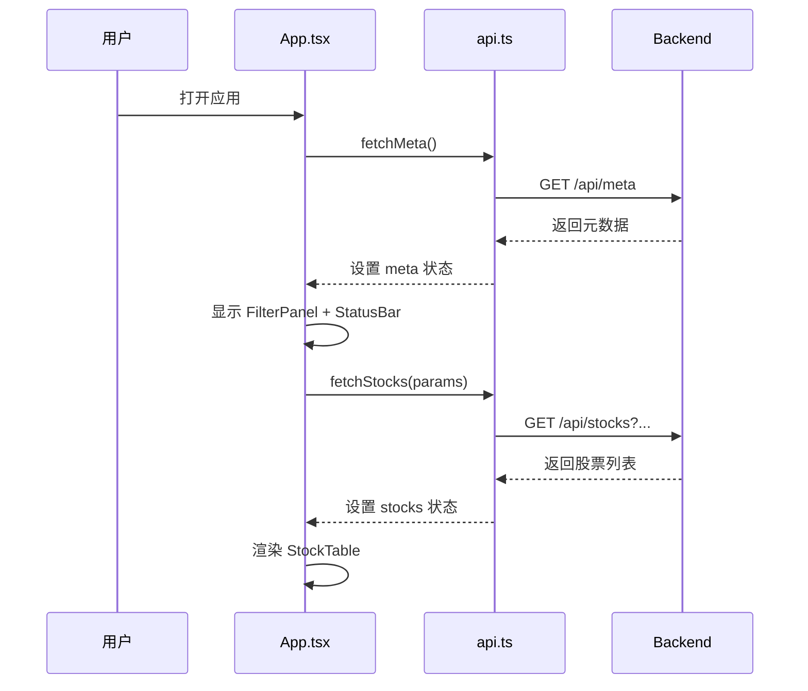
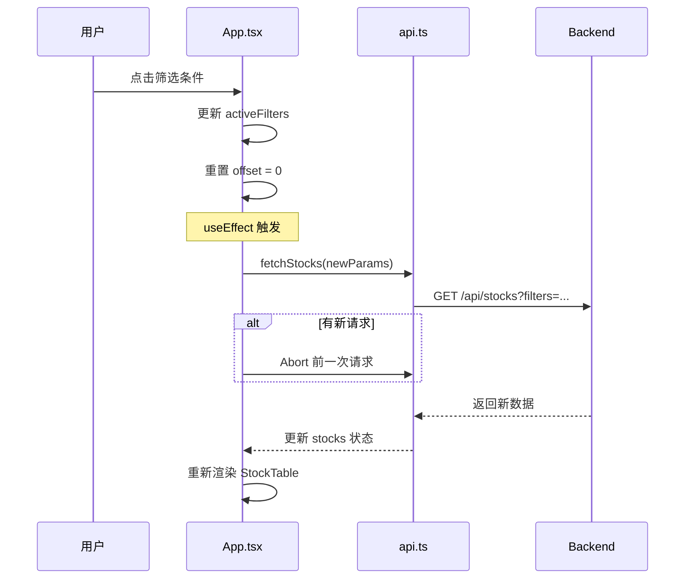

# 量化交易系统前端 - 项目设计文档

**项目名称**：量化交易系统（Quantitative Trading System）  
**模块**：前端应用（Frontend Application）  
**版本**：v0.4.0  
**创建日期**：2026-05-31  
**最后更新**：2026-06-04  
**工作目录**：`/Users/zhangk/workspace/Quantitative_trading/frontend`

---

## 📋 目录

1. [项目概述](#一项目概述)
2. [系统架构](#二系统架构)
3. [技术栈](#三技术栈)
4. [项目结构](#四项目结构)
5. [核心组件](#五核心组件)
6. [API 接口设计](#六api-接口设计)
7. [数据流设计](#七数据流设计)
8. [状态管理](#八状态管理)
9. [类型定义](#九类型定义)
10. [开发规范](#十开发规范)
11. [部署说明](#十一部署说明)
12. [待办事项](#十二待办事项)

---

## 一、项目概述

### 1.1 项目背景

本项目是一个 A 股股票筛选和展示系统，为量化交易提供数据支持。前端应用提供直观的用户界面，支持多维度筛选、排序、分页查看股票数据。

### 1.2 核心功能

- ✅ **股票列表展示**：显示股票代码、名称、行业、涨跌幅等核心指标
- ✅ **多维度筛选**：支持按技术指标、形态、行业、地区筛选
- ✅ **灵活排序**：支持 20+ 字段升序/降序排列
- ✅ **分页浏览**：每页 100 条数据，支持上下翻页
- ✅ **实时状态**：显示匹配数量、总数量、激活的筛选条件
- ✅ **K 线图展示**：点击股票行查看 K线 + 成交量双面板
- ✅ **形态识别**：保留 5 个高胜率形态（早晨之星/黄昏之星/看涨吞没/看跌吞没/锤子线）
- ✅ **三级缓存**：形态/K线/指标本地缓存 + 增量更新
- ⏳ **交易信号**：暂未实现（保留接口）

### 1.3 数据范围

- **A 股主板**：60/000 开头的股票
- **创业板**：300 开头的股票
- **排除**：科创板、北交所等其他板块

### 1.4 当前阶段

**Day 3 已完成（2026-06-04）**：K线图、形态识别、本地缓存

- ✅ KLineChart.tsx - K线 + 成交量叠加图（lightweight-charts）
- ✅ 5 个高胜率 K线形态前端识别算法
- ✅ 三级缓存架构（patternCache / klineCache / API）
- ✅ 增量更新 + LRU 淘汰
- ✅ 技术指标前端计算（MA/RSI/MACD/BOLL/KDJ）

---

## 二、系统架构

### 2.1 整体架构图

```
┌─────────────────────────────────────────────────────┐
│                   用户浏览器                         │
│              http://localhost:5173                  │
└──────────────────┬──────────────────────────────────┘
                   │
                   ▼
┌─────────────────────────────────────────────────────┐
│              Vite 开发服务器                         │
│         (Quantitative_trading/frontend)             │
│                                                      │
│  ┌──────────────────────────────────────────────┐  │
│  │          React 前端应用                       │  │
│  │  ┌────────┐ ┌──────────┐ ┌──────────────┐  │  │
│  │  │StatusBar│ │FilterPanel│ │ StockTable   │  │  │
│  │  └────────┘ └──────────┘ └──────────────┘  │  │
│  │  ┌────────────┐ ┌────────────────────────┐  │  │
│  │  │KLineChart  │ │ 3-tier Cache Layer    │  │  │
│  │  └────────────┘ │ patternCache (按日)    │  │  │
│  │                  │ klineCache (按股, LRU) │  │  │
│  │                  │ + computeAllIndicators│  │  │
│  │                  └────────────────────────┘  │  │
│  └──────────────────────────────────────────────┘  │
└──────────────────┬──────────────────────────────────┘
                   │ 代理 /api/* 请求
                   ▼
┌─────────────────────────────────────────────────────┐
│            FastAPI 后端服务                          │
│         (backend/core/api)                          │
│              http://localhost:8000                  │
│                                                      │
│  ┌──────────────────────────────────────────────┐  │
│  │  GET /api/meta/      → 元数据接口            │  │
│  │  GET /api/stocks/    → 股票列表接口          │  │
│  │  GET /api/kline/{code}?  → K 线数据接口      │  │
│  │  GET /api/signals/{code}? → 交易信号接口     │  │
│  └──────────────────────────────────────────────┘  │
│                    ↓                                │
│  ┌──────────────────────────────────────────────┐  │
│  │       数据加载器 (loader.py)                  │  │
│  │       读取 *.parquet 文件                     │  │
│  │       + PostgreSQL 行情/财务                  │  │
│  └──────────────────────────────────────────────┘  │
└─────────────────────────────────────────────────────┘
```

### 2.2 前后端分离架构

| 层次 | 技术 | 端口 | 职责 |
|------|------|------|------|
| **前端** | React + Vite + TypeScript | 5173 | UI 渲染、用户交互、状态管理 |
| **后端** | FastAPI + Pandas | 8000 | 数据处理、API 接口、业务逻辑 |
| **数据层** | Parquet 文件 | - | 股票数据存储（宽表格式） |

**数据流向**：
```
Baostock/Akshare API → 原始数据清洗 → Parquet 宽表 → FastAPI 读取 → JSON API → React 前端
```

### 2.3 通信机制

- **协议**：HTTP/HTTPS
- **数据格式**：JSON
- **跨域处理**：CORS（允许 localhost:5173）
- **请求取消**：AbortController（防止竞态条件）
- **代理配置**：Vite 代理 `/api/*` → `http://localhost:8000`

---

## 三、技术栈

### 3.1 前端技术

| 技术 | 版本 | 用途 |
|------|------|------|
| **React** | ^18.3.1 | UI 框架 |
| **TypeScript** | ^5.4.5 | 类型安全 |
| **Vite** | ^5.2.11 | 构建工具、开发服务器 |
| **TailwindCSS** | ^3.4.3 | 样式框架 |
| **lightweight-charts** | ^4.1.0 | K 线图库（Phase 4） |

### 3.2 后端技术

| 技术 | 版本 | 用途 |
|------|------|------|
| **FastAPI** | latest | Web 框架 |
| **Uvicorn** | latest | ASGI 服务器 |
| **Pandas** | latest | 数据处理 |
| **PyArrow** | latest | Parquet 文件读写 |

### 3.3 开发工具

- **包管理器**：npm（前端）、pip（后端）
- **代码规范**：ESLint、Prettier（前端）
- **类型检查**：TypeScript Compiler
- **热更新**：Vite HMR（前端）、Uvicorn reload（后端）

---

## 四、项目结构

### 4.1 完整目录树

```
frontend/                          # 前端项目根目录（src/frontend 已并入根）
│
├── 📄 配置文件
│   ├── package.json              # npm 依赖配置
│   ├── package-lock.json         # 依赖锁定文件
│   ├── tsconfig.json             # TypeScript 编译配置
│   ├── tsconfig.node.json        # Node 环境 TS 配置
│   ├── vite.config.ts            # Vite 构建配置
│   ├── tailwind.config.js        # TailwindCSS 配置
│   ├── postcss.config.js         # PostCSS 配置
│   └── index.html                # HTML 入口模板
│
├── 📁 src/                       # 源代码目录
│   │
│   ├── 📄 核心文件
│   │   ├── main.tsx              # 应用入口
│   │   ├── App.tsx               # 主应用组件 ⭐
│   │   ├── api.ts                # API 接口封装
│   │   └── types.ts              # TypeScript 类型定义
│   │
│   ├── 📁 components/            # React 组件目录
│   │   ├── StockTable.tsx        # 股票表格组件 ⭐
│   │   ├── FilterPanel.tsx       # 筛选面板组件
│   │   ├── StatusBar.tsx         # 状态栏组件
│   │   └── KLineChart.tsx        # K线 + 成交量图表 ⭐ (Day 3)
│   │
│   ├── 📁 hooks/                 # 自定义 React Hooks (Day 3)
│   │   ├── useKLineData.ts       # 单股 K线 + 缓存 + 增量 ⭐
│   │   └── useBatchKLine.ts      # 批量 K线 + 三级缓存 ⭐
│   │
│   ├── 📁 utils/                 # 工具模块 (Day 3)
│   │   ├── patternDetector.ts    # 5 个高胜率 K线形态识别算法 ⭐
│   │   ├── patternCache.ts       # 形态结果缓存（按 trade_date）
│   │   ├── klineCache.ts         # K线数据 LRU 缓存（200 只/100 天）⭐
│   │   └── indicators.ts         # MA/RSI/MACD/BOLL/KDJ 计算
│   │
│   └── 📁 mocks/                 # 开发期 Mock 数据
│       └── meta.ts               # 字段元数据 Mock
│
├── 📁 public/                    # 静态资源目录
│
├── 📁 node_modules/              # 依赖包目录（已忽略）
│
├── 📁 dist/                      # 生产构建输出（已忽略）
│
└── 📄 项目文档
    ├── README.md                 # 项目说明
    ├── PROJECT_DESIGN.md         # 项目设计文档（本文档）⭐
    ├── WORK_PLAN.md              # 工作计划
    ├── TASK_CHECKLIST.md         # 任务清单
    ├── RUNNING_GUIDE.md          # 运行指南
    └── CODING_STANDARDS.md       # 编码规范
```

**图例说明**：
- ⭐ 标记为核心文件
- 📄 表示文件
- 📁 表示目录

### 4.2 代码统计

| 类别 | 文件数 | 说明 |
|------|--------|------|
| **React 组件** | 4 | App + 3 个子组件 + KLineChart |
| **自定义 Hooks** | 2 | useKLineData、useBatchKLine |
| **工具模块** | 4 | patternDetector、patternCache、klineCache、indicators |
| **API/类型** | 2 | api.ts、types.ts |
| **MOCK** | 1 | mocks/meta.ts |
| **配置文件** | 7 | Vite + TS + Tailwind 等 |
| **文档文件** | 6 | README + 设计 + 计划 + 规范 + 指南 + 清单 |

### 4.3 关键文件详细说明

#### 4.3.1 核心源代码文件

| 文件路径 | 行数 | 类型 | 职责 | 关键功能 |
|---------|------|------|------|----------|
| **src/App.tsx** | 288 | React 组件 | 应用根组件 | 状态管理、数据加载、组件整合 |
| **src/components/StockTable.tsx** | 322 | React 组件 | 股票表格展示 | 排序、分页、字段展开、颜色标记 |
| **src/components/FilterPanel.tsx** | 156 | React 组件 | 筛选面板 | 多维度筛选条件选择 |
| **src/components/StatusBar.tsx** | 78 | React 组件 | 状态栏 | 显示激活条件和统计信息 |
| **src/api.ts** | 46 | TypeScript | API 封装 | 4个接口调用函数 |
| **src/types.ts** | 109 | TypeScript | 类型定义 | 10+接口和类型定义 |
| **src/main.tsx** | 9 | TypeScript | 应用入口 | React DOM 渲染 |
| **src/index.css** | - | CSS | 全局样式 | TailwindCSS 指令 |

#### 4.3.2 配置文件

| 文件路径 | 行数 | 用途 | 关键配置 |
|---------|------|------|----------|
| **package.json** | 26 | 依赖管理 | React 18、Vite 5、TypeScript 5、TailwindCSS 3 |
| **tsconfig.json** | 25 | TS 编译配置 | strict模式、ES2020、JSX react-jsx、路径别名 @/* |
| **vite.config.ts** | 22 | Vite 配置 | React插件、代理配置(/api→localhost:8000)、端口5173 |
| **tailwind.config.js** | 11 | Tailwind 配置 | 扫描 src/**/*.{js,ts,jsx,tsx} |
| **postcss.config.js** | - | PostCSS 配置 | TailwindCSS + Autoprefixer |
| **index.html** | 13 | HTML 模板 | 标题"量化选股系统"、挂载点 #root |
| **tsconfig.node.json** | - | Node TS 配置 | Vite 配置的 TS 支持 |

#### 4.3.3 项目文档

| 文件路径 | 行数 | 类型 | 用途 | 创建日期 |
|---------|------|------|------|----------|
| **PROJECT_DESIGN.md** | 995 | 设计文档 | 完整的项目设计和技术说明 | 2026-05-31 |
| **WORK_PLAN.md** | 301 | 计划文档 | Phase 1.3 详细实施计划 | 2026-05-31 |
| **TASK_CHECKLIST.md** | 279 | 任务清单 | 任务分解和进度跟踪 | 2026-05-31 |
| **ACCEPTANCE_REPORT.md** | 323 | 验收报告 | Phase 1.3 验收文档 | 2026-05-31 |
| **RUNNING_GUIDE.md** | 315 | 运行指南 | 启动、调试、常见问题 | 2026-05-31 |
| **COMMIT_MESSAGE.txt** | 86 | 提交说明 | Git commit 模板 | 2026-05-31 |
| **README.md** | - | 项目说明 | 项目概述和快速开始 | - |
| **CODING_STANDARDS.md** | - | 编码规范 | 代码风格和最佳实践 | - |
| **DEPENDENCIES_GUIDE.md** | - | 依赖指南 | 依赖包说明和版本管理 | - |
| **QUICK_REFERENCE.md** | - | 快速参考 | 常用命令和快捷方式 | - |

### 4.4 文件依赖关系图

```
index.html
    ↓ 引入
main.tsx
    ↓ 渲染
App.tsx
    ├─→ 引入 → api.ts
    │           ↓ 使用
    │        types.ts
    ├─→ 引入 → StatusBar.tsx
    ├─→ 引入 → FilterPanel.tsx
    └─→ 引入 → StockTable.tsx
                ↓ 使用
             types.ts
```

### 4.5 模块职责划分

#### 表现层（UI Components）
- **App.tsx**：应用容器，状态管理中心
- **StockTable.tsx**：数据展示，用户交互
- **FilterPanel.tsx**：筛选输入
- **StatusBar.tsx**：状态反馈

#### 服务层（Services）
- **api.ts**：HTTP 请求封装，数据获取

#### 类型层（Types）
- **types.ts**：TypeScript 类型定义，接口契约

#### 配置层（Configuration）
- **vite.config.ts**：构建和开发服务器配置
- **tsconfig.json**：TypeScript 编译规则
- **tailwind.config.js**：样式框架配置
- **package.json**：依赖和脚本管理

---

## 五、核心组件

### 5.1 App.tsx - 主应用组件

**文件路径**：`src/App.tsx`  
**行数**：165 行  
**职责**：应用根组件，整合所有子组件，管理全局状态

#### 5.1.1 状态管理

```typescript
// 数据状态
const [meta, setMeta] = useState<MetaResponse | null>(null)
const [stocks, setStocks] = useState<StocksResponse | null>(null)
const [loading, setLoading] = useState(false)
const [error, setError] = useState<string | null>(null)

// 筛选状态
const [activeFilters, setActiveFilters] = useState<string[]>([])
const [activeIndustries, setActiveIndustries] = useState<string[]>([])
const [activeAreas, setActiveAreas] = useState<string[]>([])

// 排序状态
const [sortBy, setSortBy] = useState('pct_chg')
const [sortAsc, setSortAsc] = useState(false)

// 分页状态
const [offset, setOffset] = useState(0)
```

#### 5.1.2 生命周期

1. **挂载时**：调用 `fetchMeta()` 加载元数据
2. **状态变化时**：调用 `fetchStocks()` 加载股票列表
3. **卸载时**：中止未完成的请求

#### 5.1.3 事件处理

| 函数 | 参数 | 功能 |
|------|------|------|
| `toggleFilter` | key: string | 切换筛选条件 |
| `toggleIndustry` | val: string | 切换行业筛选 |
| `toggleArea` | val: string | 切换地区筛选 |
| `clearAll` | - | 清空所有筛选 |
| `removeFilter` | key: string | 从状态栏删除单个条件 |
| `handleSort` | key: string | 处理列头排序点击 |

#### 5.1.4 布局结构

```
┌──────────────────────────────────────┐
│          StatusBar                   │ ← 顶部状态栏
├──────────┬───────────────────────────┤
│          │                           │
│ Filter   │      Main Content         │
│ Panel    │  ┌─────────────────────┐  │
│          │  │   Loading Indicator │  │
│          │  ├─────────────────────┤  │
│          │  │                     │  │
│          │  │   StockTable        │  │
│          │  │                     │  │
│          │  └─────────────────────┘  │
│          │                           │
└──────────┴───────────────────────────┘
```

---

### 5.2 StockTable.tsx - 股票表格组件

**文件路径**：`src/components/StockTable.tsx`  
**行数**：224 行  
**职责**：展示股票列表，支持排序、分页、字段展开

#### 5.2.1 核心功能

- ✅ 显示 12 个默认列（代码、名称、行业、涨跌幅等）
- ✅ 支持展开/收起额外字段（最多 25+ 列）
- ✅ 点击列头排序（升序/降序切换）
- ✅ 分页功能（上一页/下一页）
- ✅ 颜色标记（红涨绿跌）
- ✅ 股票代码链接到同花顺
- ✅ onRowClick 回调（预留 K 线联动）

#### 5.2.2 Props 接口

```typescript
interface StockTableProps {
  rows: StockRow[]              // 股票数据数组
  total: number                 // 总记录数
  offset: number                // 当前偏移
  limit: number                 // 每页数量
  sortBy: string                // 排序字段
  sortAsc: boolean              // 是否升序
  activeFilters: string[]       // 激活的筛选条件
  onSort: (key: string) => void // 排序回调
  onPageChange: (offset: number) => void // 分页回调
}
```

#### 5.2.3 工具函数

| 函数 | 功能 | 示例 |
|------|------|------|
| `fmt()` | 格式化数值 | `+5.23%`, `-3.45%`, `1.2亿` |
| `cellColor()` | 确定单元格颜色 | 红涨绿跌 |

#### 5.2.4 可排序字段

```
pct_chg, close, total_mv, amount,
turnover_rate, volume_ratio, net_mf_amount,
pe, pb, vol_ratio_5
```

---

### 5.3 FilterPanel.tsx - 筛选面板组件

**文件路径**：`src/components/FilterPanel.tsx`  
**行数**：157 行  
**职责**：提供多维度筛选选项

#### 5.3.1 筛选维度

1. **技术指标**：突破新高、连续上涨、量比等
2. **K 线形态**：锤子线、十字星、吞没形态等
3. **行业分类**：银行、地产、科技等
4. **地区分布**：北京、上海、广东等

#### 5.3.2 Props 接口

```typescript
interface FilterPanelProps {
  groups: FilterGroup[]
  industryOptions: string[]
  areaOptions: string[]
  activeFilters: string[]
  activeIndustries: string[]
  activeAreas: string[]
  onToggleFilter: (key: string) => void
  onToggleIndustry: (val: string) => void
  onToggleArea: (val: string) => void
}
```

---

### 5.4 StatusBar.tsx - 状态栏组件

**文件路径**：`src/components/StatusBar.tsx`  
**行数**：79 行  
**职责**：显示当前筛选状态和统计信息

#### 5.4.1 显示内容

- 交易日期
- 匹配数量 / 总数量
- 激活的筛选条件标签
- 清空所有按钮
- 删除单个条件按钮

#### 5.4.2 Props 接口

```typescript
interface StatusBarProps {
  tradeDate: string
  matchCount: number
  totalCount: number
  activeFilters: string[]
  activeIndustries: string[]
  activeAreas: string[]
  filterLabels: Record<string, string>
  onClearAll: () => void
  onRemoveFilter: (key: string) => void
}
```

---

## 六、API 接口设计

### 6.1 接口概览

| 接口 | 方法 | 状态 | 用途 |
|------|------|------|------|
| `/api/meta` | GET | ✅ 已实现 | 获取元数据 |
| `/api/stocks` | GET | ✅ 已实现 | 获取股票列表 |
| `/api/kline/{code}` | GET | ⏳ 预留 | 获取 K 线数据 |
| `/api/signals/{code}` | GET | ⏳ 预留 | 获取交易信号 |

---

### 6.2 GET /api/meta - 元数据接口

**用途**：获取筛选条件、行业列表、地区列表等元数据

**调用时机**：应用启动时调用一次

**请求参数**：无

**响应格式**：
```typescript
interface MetaResponse {
  trade_date: string           // 交易日期，如 "20240101"
  total: number                // 股票总数
  groups: FilterGroup[]        // 筛选条件分组
  industry_options: string[]   // 行业选项列表
  area_options: string[]       // 地区选项列表
}

interface FilterGroup {
  id: string                   // 分组 ID
  label: string                // 分组标签
  fields: FilterField[]        // 字段列表
}

interface FilterField {
  key: string                  // 字段键名
  label: string                // 字段标签
  count: number                // 符合条件的股票数量
}
```

**响应示例**：
```json
{
  "trade_date": "20240101",
  "total": 5000,
  "groups": [
    {
      "id": "breakthrough",
      "label": "突破形态",
      "fields": [
        { "key": "break_high_20", "label": "突破20日新高", "count": 150 },
        { "key": "break_high_60", "label": "突破60日新高", "count": 80 }
      ]
    }
  ],
  "industry_options": ["银行", "地产", "科技", "医药"],
  "area_options": ["北京", "上海", "广东", "浙江"]
}
```

**后端实现**：`stock_screener/backend/main.py` 第 37-45 行

---

### 6.3 GET /api/stocks - 股票列表接口

**用途**：根据筛选条件、排序、分页获取股票数据

**调用时机**：筛选条件、排序、分页变化时调用

**请求参数**：

| 参数 | 类型 | 必填 | 默认值 | 说明 |
|------|------|------|--------|------|
| filters | string | 否 | "" | 筛选条件（逗号分隔） |
| industry | string | 否 | "" | 行业（逗号分隔） |
| area | string | 否 | "" | 地区（逗号分隔） |
| sort_by | string | 否 | "pct_chg" | 排序字段 |
| sort_asc | boolean | 否 | false | 是否升序 |
| offset | int | 否 | 0 | 分页偏移（≥0） |
| limit | int | 否 | 100 | 每页数量（1-500） |

**请求示例**：
```
GET /api/stocks?filters=break_high_20,pattern_hammer&industry=银行&sort_by=pct_chg&sort_asc=false&offset=0&limit=100
```

**响应格式**：
```typescript
interface StocksResponse {
  total: number                // 总记录数
  offset: number               // 当前偏移
  limit: number                // 每页数量
  rows: StockRow[]             // 股票记录数组
}
```

**StockRow 数据结构**：
```typescript
interface StockRow {
  // 核心字段
  ts_code: string              // 股票代码，如 "600000.SH"
  name: string                 // 股票名称
  industry: string             // 行业
  area: string                 // 地区
  pct_chg: number              // 涨跌幅（%）
  close: number                // 收盘价
  pe: number                   // 市盈率
  pb: number                   // 市净率
  total_mv: number             // 总市值（万元）
  amount: number               // 成交额（万元）
  turnover_rate: number        // 换手率（%）
  volume_ratio: number         // 量比
  net_mf_amount: number        // 净流入（元）
  
  // 可选字段（展开时显示）
  open?: number                // 开盘价
  high?: number                // 最高价
  low?: number                 // 最低价
  pre_close?: number           // 昨收价
  change?: number              // 涨跌额
  vol?: number                 // 成交量
  pe_ttm?: number              // 市盈率 TTM
  ps?: number                  // 市销率
  circ_mv?: number             // 流通市值
  float_share?: number         // 流通股本
  
  // 资金流向
  buy_sm_amount?: number       // 小单买入
  sell_sm_amount?: number      // 小单卖出
  buy_md_amount?: number       // 中单买入
  sell_md_amount?: number      // 中单卖出
  buy_lg_amount?: number       // 大单买入
  sell_lg_amount?: number      // 大单卖出
  
  // 技术形态（0/1 标志）
  break_high_20?: number       // 突破20日新高
  break_high_60?: number       // 突破60日新高
  consec_up_days?: number      // 连续上涨天数
  vol_ratio_5?: number         // 5日量比
  pattern_bull_candle?: number // 阳线
  pattern_bear_candle?: number // 阴线
  pattern_hammer?: number      // 锤子线
  pattern_doji?: number        // 十字星
  // ... 更多形态字段
}
```

**响应示例**：
```json
{
  "total": 150,
  "offset": 0,
  "limit": 100,
  "rows": [
    {
      "ts_code": "600000.SH",
      "name": "浦发银行",
      "industry": "银行",
      "area": "上海",
      "pct_chg": 5.23,
      "close": 10.50,
      "pe": 6.8,
      "pb": 0.9,
      "total_mv": 3000000,
      "amount": 50000,
      "turnover_rate": 1.2,
      "volume_ratio": 1.5,
      "net_mf_amount": 10000000,
      "break_high_20": 1,
      "pattern_hammer": 0
    }
  ]
}
```

**筛选逻辑**：
- **filters**：AND 逻辑（所有条件都要满足）
- **industry**：OR 逻辑（满足任一行业即可）
- **area**：OR 逻辑（满足任一地区即可）

**排序规则**：
- NaN 值统一置底（后端处理）
- 隐式追加 `ts_code` 作为第二排序键（保证稳定性）

**后端实现**：`stock_screener/backend/main.py` 第 48-90 行

---

### 6.4 GET /api/kline/{code} - K 线数据接口（预留）

**状态**：⏳ Phase 4 开发  
**用途**：获取指定股票的 K 线数据

**请求参数**：
- `code`：股票代码（路径参数）
- `cycle`：周期（查询参数），默认 "daily"

**响应格式**：
```typescript
interface KlineData {
  code: string
  name: string
  cycle: string
  bars: KlineBar[]
}

interface KlineBar {
  time: string      // 时间，如 "2024-01-01"
  open: number      // 开盘价
  high: number      // 最高价
  low: number       // 最低价
  close: number     // 收盘价
  volume: number    // 成交量
}
```

---

### 6.5 GET /api/signals/{code} - 交易信号接口（预留）

**状态**：⏳ Phase 5 开发  
**用途**：获取指定股票的交易信号

**请求参数**：
- `code`：股票代码（路径参数）
- `strategy`：策略名称（查询参数），默认 "macd_cross"

**响应格式**：
```typescript
interface SignalResponse {
  code: string
  name: string
  strategy: string
  signals: Signal[]
}

interface Signal {
  id: string
  date: string
  type: 'buy' | 'sell'
  price: number
  strategy: string
  reason: string
}
```

---

## 七、数据流设计

### 7.1 应用启动流程



### 7.2 用户操作流程



### 7.3 并发请求处理

使用 **AbortController** 防止竞态条件：

```typescript
useEffect(() => {
  const controller = new AbortController()
  
  fetchStocks({ ..., signal: controller.signal })
    .then(setStocks)
    .catch(e => { 
      if (e.name !== 'AbortError') setError(e.message) 
    })
  
  return () => controller.abort() // 清理：中止请求
}, [dependencies])
```

**工作原理**：
1. 每次依赖变化时，创建新的 AbortController
2. 发起新请求时传入 signal
3. 清理函数中 abort 前一次请求
4. 捕获 AbortError 不显示错误

---

## 八、状态管理

### 8.1 状态分类

| 类别 | 状态 | 类型 | 初始值 | 说明 |
|------|------|------|--------|------|
| **数据** | meta | MetaResponse \| null | null | 元数据 |
| **数据** | stocks | StocksResponse \| null | null | 股票列表 |
| **UI** | loading | boolean | false | 加载状态 |
| **UI** | error | string \| null | null | 错误信息 |
| **筛选** | activeFilters | string[] | [] | 激活的筛选条件 |
| **筛选** | activeIndustries | string[] | [] | 激活的行业 |
| **筛选** | activeAreas | string[] | [] | 激活的地区 |
| **排序** | sortBy | string | 'pct_chg' | 排序字段 |
| **排序** | sortAsc | boolean | false | 是否升序 |
| **分页** | offset | number | 0 | 分页偏移 |

### 8.2 状态流转图

```
用户操作
   ↓
更新状态（setActiveFilters / setSortBy / setOffset）
   ↓
useEffect 检测到依赖变化
   ↓
创建 AbortController
   ↓
调用 fetchStocks()
   ↓
设置 loading = true
   ↓
等待后端响应
   ↓
成功：setStocks(data)
失败：setError(message)
   ↓
设置 loading = false
   ↓
组件重新渲染
```

### 8.3 状态更新规则

1. **筛选条件变化** → 重置 offset = 0
2. **排序变化** → 重置 offset = 0
3. **分页变化** → 仅更新 offset
4. **多个状态同时变化** → 只触发一次 API 调用（React 批量更新）

---

## 九、类型定义

### 9.1 核心类型

详见 `src/types.ts`（110 行）

#### 9.1.1 响应类型

- `MetaResponse` - 元数据响应
- `StocksResponse` - 股票列表响应
- `KlineData` - K 线数据响应（预留）
- `SignalResponse` - 交易信号响应（预留）

#### 9.1.2 数据模型

- `StockRow` - 股票行数据（70+ 字段）
- `KlineBar` - K 线柱状数据
- `Signal` - 交易信号

#### 9.1.3 筛选类型

- `FilterField` - 筛选项
- `FilterGroup` - 筛选分组

### 9.2 类型安全保证

- ✅ 严格模式（strict: true）
- ✅ 无 `any` 类型
- ✅ 所有 API 返回值有明确类型
- ✅ 组件 Props 有完整接口定义

---

## 十、开发规范

### 10.1 代码规范

#### 10.1.1 命名规范

- **变量/函数**：camelCase（如 `activeFilters`、`toggleFilter`）
- **组件**：PascalCase（如 `StockTable`、`FilterPanel`）
- **类型/接口**：PascalCase（如 `StockRow`、`MetaResponse`）
- **常量**：UPPER_SNAKE_CASE（如 `LIMIT`、`BASE`）

#### 10.1.2 注释规范

- **所有代码注释使用中文**
- 组件开头添加 JSDoc 说明功能和职责
- 复杂逻辑添加行内注释
- 关键函数添加参数和返回值说明

#### 10.1.3 文件组织

```typescript
// 1. 导入语句
import { useState } from 'react'
import type { StockRow } from './types'

// 2. 常量定义
const LIMIT = 100

// 3. 工具函数
function fmt(value: number): string { ... }

// 4. 组件定义
export default function StockTable(props: StockTableProps) { ... }
```

### 10.2 架构约束

- ⛔ **禁止自由推导字段**：所有类型必须来自 types.ts
- ⛔ **禁止跨层调用**：组件 → api.ts → 后端 API
- ⛔ **禁止硬编码**：配置项使用常量或环境变量
- ✅ **单一职责**：每个组件只做一件事

### 10.3 性能优化

- ✅ 使用 `useCallback` 包裹事件处理函数
- ✅ 列表渲染使用唯一 `key`（stock.ts_code）
- ✅ 避免不必要的重渲染
- ✅ 使用 AbortController 取消过期请求

### 10.4 安全规范

- ✅ 外部链接使用 `rel="noopener noreferrer"`
- ✅ 无 `dangerouslySetInnerHTML` 使用
- ✅ 无敏感信息硬编码
- ✅ URL 参数正确编码

### 10.5 代码审查（6 维度）

每个任务完成后必须进行 6 维度审查：

1. **逻辑正确性**：算法、状态管理、副作用处理
2. **安全性**：XSS、CSRF、敏感信息
3. **性能**：重渲染、内存泄漏、网络请求
4. **健壮性**：空值处理、错误捕获、边界条件
5. **可维护性**：命名、注释、结构、职责
6. **合规性**：数据范围、limit 限制、无未来函数

---

## 十一、部署说明

### 11.1 开发环境

#### 启动后端

```bash
cd /Users/zhangk/workspace/stock_screener/backend
uvicorn main:app --reload --host 0.0.0.0 --port 8000
```

#### 启动前端

```bash
cd /Users/zhangk/workspace/Quantitative_trading/src/frontend
npm run dev
```

#### 访问地址

- 前端：http://localhost:5173
- 后端：http://localhost:8000
- API 文档：http://localhost:8000/docs

### 11.2 生产构建

#### 构建前端

```bash
cd /Users/zhangk/workspace/Quantitative_trading/src/frontend
npm run build
```

生成文件位于 `dist/` 目录。

#### 部署方案

**方案一：后端托管前端（推荐）**

FastAPI 已配置静态文件服务：

```python
if STATIC_DIR.exists():
    app.mount("/assets", StaticFiles(directory=STATIC_DIR / "assets"))
    
    @app.get("/{full_path:path}")
    def spa_fallback(full_path: str = ""):
        return FileResponse(STATIC_DIR / "index.html")
```

只需将 `dist/` 复制到 `stock_screener/frontend/dist/`，后端会自动托管。

**方案二：独立部署**

- 前端：Nginx 托管静态文件
- 后端：Gunicorn + Uvicorn workers
- 配置 Nginx 反向代理 `/api/*` → 后端

### 11.3 环境变量

当前使用硬编码配置，建议后续改为环境变量：

```typescript
// 当前
const BASE = '/api'

// 建议
const BASE = import.meta.env.VITE_API_BASE || '/api'
```

---

## 十二、数据架构

### 12.1 数据存储方案

**当前方案**：Parquet 宽表文件

| 项目 | 值 |
|------|-----|
| **文件格式** | Apache Parquet（列式存储） |
| **文件位置** | `Quantitative_trading/data/price/daily/latest_quotes.parquet` |
| **文件大小** | ~2.5 MB |
| **数据量** | 5,484 行 × 205 列 |
| **加载方式** | 应用启动时一次性加载到内存 |
| **更新频率** | 每日收盘后更新 |

**优势**：
- ✅ 列式存储，查询效率高
- ✅ 压缩率高，文件体积小
- ✅ Pandas 原生支持，加载速度快
- ✅ 适合中小规模数据（< 100万行）

**局限**：
- ⚠️ 全量加载到内存，大数据量下占用较多 RAM
- ⚠️ 不支持并发写入
- ⚠️ 缺少事务支持

---

### 12.2 数据结构（205个字段）

#### 12.2.1 字段分类统计

| 类别 | 字段数 | 示例 |
|------|--------|------|
| **基本信息** | 5 | ts_code, name, industry, area, trade_date |
| **行情数据** | 10 | close, open, high, low, pct_chg, vol, amount... |
| **估值指标** | 6 | pe, pe_ttm, pb, ps, dv_ratio, dv_ttm |
| **市值股本** | 5 | total_mv, circ_mv, total_share, float_share, free_share |
| **资金流向** | 16 | buy/sell_sm/md/lg/elg_vol + amount |
| **技术指标** | 16 | MACD(3), KDJ(3), RSI(3), BOLL(3), CCI... |
| **复权价格** | 5 | close_hfq/qfq, pre_close_hfq/qfq... |
| **K线形态** | **127** | pattern_* 系列（锤子线、十字星等） |
| **突破连续** | 7 | break_high_*, consec_up_* |
| **量价关系** | 8 | vol_ratio_5, pattern_vol_price_*... |

#### 12.2.2 核心字段说明

**基本信息**：
```typescript
interface BasicInfo {
  ts_code: string        // 股票代码，如 "000001.SZ"
  name: string           // 股票名称
  industry: string       // 行业分类
  area: string           // 地区
  trade_date: string     // 交易日期，如 "20260420"
}
```

**行情数据**：
```typescript
interface QuoteData {
  close: number          // 收盘价
  open: number           // 开盘价
  high: number           // 最高价
  low: number            // 最低价
  pre_close: number      // 昨收价
  pct_chg: number        // 涨跌幅（%）
  vol: number            // 成交量（手）
  amount: number         // 成交额（千元）
  turnover_rate: number  // 换手率（%）
  volume_ratio: number   // 量比
}
```

**K线形态标志**（127个）：
```typescript
// 所有 pattern_* 字段均为 0/1 二元标志
interface Patterns {
  pattern_hammer: number              // 锤子线
  pattern_doji: number                // 十字星
  pattern_bullish_engulfing: number   // 看涨吞没
  pattern_bearish_engulfing: number   // 看跌吞没
  pattern_morning_star: number        // 早晨之星
  pattern_evening_star: number        // 黄昏之星
  // ... 共127个形态字段
}
```

---

### 12.3 数据加载流程

#### 12.3.1 后端加载逻辑（loader.py）

```python
# 1. 读取 Parquet 文件
df = pd.read_parquet(PARQUET_PATH)

# 2. 提取交易日期
trade_date = str(df["trade_date"].iloc[0])  # "20260420"

# 3. 统计二元标志字段的命中次数
binary_prefixes = ("pattern_", "break_high_", "consec_up_")
binary_cols = [c for c in df.columns if c.startswith(binary_prefixes)]
field_counts = {c: int(df[c].sum()) for c in binary_cols}
```

**加载时机**：FastAPI 应用启动时（lifespan 事件）

**内存占用**：~50 MB（5,484 行 × 205 列）

#### 12.3.2 前端使用流程

```
1. App.tsx 挂载
   ↓
2. 调用 fetchMeta() → GET /api/meta
   ↓
3. 后端返回元数据（trade_date, total, groups, industry_options, area_options）
   ↓
4. 用户筛选/排序/分页
   ↓
5. 调用 fetchStocks(params) → GET /api/stocks?... 
   ↓
6. 后端从内存 DataFrame 过滤、排序、分页
   ↓
7. 返回 JSON 响应（total, offset, limit, rows[]）
   ↓
8. StockTable.tsx 渲染表格
```

---

### 12.4 数据目录结构

```
Quantitative_trading/data/
├── metadata/                    # 元数据
│   └── stock_list.parquet      # 股票列表（5,525只）
│
├── price/                       # 行情数据
│   └── daily/                   # 日线数据
│       └── latest_quotes.parquet  ⭐ 主数据文件（2.5MB）
│
├── raw/                         # 原始数据（待补充）
│   ├── baostock/daily/         # Baostock 原始数据
│   └── akshare/daily/          # Akshare 原始数据
│
├── snapshot/latest/             # 实时快照（待补充）
│   └── {ts_code}.json          # 单个股票快照
│
└── backup/                      # 数据库备份（待补充）
    └── {date}_backup.sql       # PostgreSQL dump
```

---

### 12.5 数据质量保证

#### 12.5.1 数据完整性

- ✅ **唯一性约束**：每只股票每个交易日仅一条记录
- ✅ **非空检查**：核心字段（ts_code, trade_date, close）不允许为空
- ✅ **范围校验**：涨跌幅、换手率等在合理范围内

#### 12.5.2 数据一致性

- ✅ **复权一致性**：所有价格字段使用同一复权方式（前复权）
- ✅ **计算一致性**：涨跌幅基于不复权原始价格计算
- ✅ **时间一致性**：所有数据对齐到同一交易日

#### 12.5.3 数据更新策略

**当前策略**：每日收盘后手动更新

**建议优化**：
1. 自动化采集：定时任务每日 16:00 自动下载
2. 增量更新：仅更新当日数据，避免全量重算
3. 版本管理：保留历史版本，支持回滚

---

### 12.6 未来扩展方向

#### 方案 A：PostgreSQL 数据库（推荐生产环境）

**优势**：
- ✅ 支持大规模数据（千万级记录）
- ✅ 并发读写支持
- ✅ ACID 事务保证
- ✅ 复杂的 SQL 查询能力
- ✅ 冷热数据分离（分区表）

**迁移成本**：中等（需要设计表结构、迁移脚本）

#### 方案 B：保持 Parquet + 优化

**优化点**：
- ✅ 按行业/地区分片存储
- ✅ 增加索引文件加速查询
- ✅ 使用 PyArrow 直接读取（无需加载到 Pandas）

**适用场景**：数据量 < 100万行，单机部署

#### 方案 C：混合架构

- **热数据**：最近 1 年 → PostgreSQL
- **温数据**：1-3 年 → Parquet 分区文件
- **冷数据**：3 年以上 → 对象存储（S3/OSS）

---

### 12.7 相关文档

- **DATA_SCHEMA.md** - 完整的数据架构文档（983行）
- **DATA_DIRECTORY_PLAN.md** - 数据目录规划（164行）
- **implementation_plan.md** - 实施计划

---

## 十三、待办事项

### 12.1 P0 - 高优先级

| 任务 | 说明 | 预计时间 |
|------|------|---------|
| **适配统一响应信封** | api.ts 解析 `{"code", "message", "data"}` 格式 | schemas.py 完成后 |
| **严格对齐类型** | types.ts 镜像 schemas.py 定义 | schemas.py 确认后 |

### 12.2 P1 - 中优先级

| 任务 | 说明 | 预计时间 |
|------|------|---------|
| **开发 KLineChart.tsx** | K 线图组件，使用 lightweight-charts | Phase 4（2-3天） |
| **集成 K 线到 App.tsx** | 点击股票行显示 K 线图 | Phase 4（1天） |
| **实现 /api/kline 接口** | 后端 K 线数据接口 | Phase 4（2天） |

### 12.3 P2 - 低优先级

| 任务 | 说明 | 预计时间 |
|------|------|---------|
| **编写单元测试** | Jest + React Testing Library | Phase 5（3-5天） |
| **实现 /api/signals 接口** | 交易信号接口 | Phase 5（3天） |
| **添加 E2E 测试** | Cypress 或 Playwright | Phase 5（2-3天） |

### 12.4 P3 - 优化项

| 任务 | 说明 | 预计时间 |
|------|------|---------|
| **虚拟滚动** | 大数据量下优化性能 | Phase 5（2天） |
| **缓存策略** | SWR 或 React Query | Phase 5（2天） |
| **国际化** | i18n 支持 | 待定 |
| **主题切换** | 深色/浅色主题 | 待定 |

---

## 附录

### A. 参考资料

- [React 官方文档](https://react.dev)
- [TypeScript 手册](https://www.typescriptlang.org/docs)
- [TailwindCSS 文档](https://tailwindcss.com/docs)
- [FastAPI 文档](https://fastapi.tiangolo.com)
- [Vite 指南](https://vitejs.dev/guide)

### B. 相关文档

- [WORK_PLAN.md](./WORK_PLAN.md) - 工作计划
- [TASK_CHECKLIST.md](./TASK_CHECKLIST.md) - 任务清单
- [ACCEPTANCE_REPORT.md](./ACCEPTANCE_REPORT.md) - 验收报告
- [RUNNING_GUIDE.md](./RUNNING_GUIDE.md) - 运行指南

### C. 版本历史

| 版本 | 日期 | 说明 |
|------|------|------|
| v0.1.0 | 2026-05-31 | Phase 1.3 完成，基础组件迁移 |
| v0.2.0 | 2026-06-03 | Phase 2 完成，巡检问题修复（KDJ/RSI 越界、.env 保护、依赖补齐） |
| v0.3.0 | 2026-06-04 | Day 2 完成，K线图组件 + lightweight-charts 集成 |
| v0.4.0 | 2026-06-04 | **Day 3 完成**：形态识别 + 三级本地缓存（patternCache/klineCache/indicators）|

---

## Day 3 工作总结（2026-06-04）

### D.1 已完成

| 功能 | 文件 | 说明 |
|------|------|------|
| **K线图组件** | [src/components/KLineChart.tsx](file:///Users/zhangk/workspace/Quantitative_trading/frontend/src/components/KLineChart.tsx) | K线 + 成交量双面板（lightweight-charts） |
| **5 个高胜率形态** | [src/utils/patternDetector.ts](file:///Users/zhangk/workspace/Quantitative_trading/frontend/src/utils/patternDetector.ts) | 早晨之星 / 黄昏之星 / 看涨吞没 / 看跌吞没 / 锤子线 |
| **三级缓存架构** | [src/utils/patternCache.ts](file:///Users/zhangk/workspace/Quantitative_trading/frontend/src/utils/patternCache.ts) + [src/utils/klineCache.ts](file:///Users/zhangk/workspace/Quantitative_trading/frontend/src/utils/klineCache.ts) | 形态 / K线 / 指标分层缓存 |
| **前端技术指标** | [src/utils/indicators.ts](file:///Users/zhangk/workspace/Quantitative_trading/frontend/src/utils/indicators.ts) | MA5/10/20、RSI6、MACD(12,26,9)、BOLL(20,2σ)、KDJ(9,3,3) |
| **缓存 Hook** | [src/hooks/useKLineData.ts](file:///Users/zhangk/workspace/Quantitative_trading/frontend/src/hooks/useKLineData.ts) + [src/hooks/useBatchKLine.ts](file:///Users/zhangk/workspace/Quantitative_trading/frontend/src/hooks/useBatchKLine.ts) | 集成三级缓存 + 增量更新 |
| **元数据过滤** | [src/App.tsx](file:///Users/zhangk/workspace/Quantitative_trading/frontend/src/App.tsx) | `HIDDEN_FIELD_KEYS` Set 过滤废弃字段 |

### D.2 数据保存格式

| 层级 | 格式 | 位置 | 容量 |
|------|------|------|------|
| 后端原始数据 | `*.parquet` | `data/*.parquet` | GB 级 |
| 后端 API 响应 | JSON | HTTP | 每次请求 |
| 前台 localStorage | JSON 字符串 | 浏览器 | 5-10 MB |
| 形态缓存 | JSON | localStorage | ~50 KB |
| K线 + 指标缓存 | JSON | localStorage | ~4 MB（200 只/100 天） |

**为什么不用 parquet？** parquet 是列式二进制格式（pandas 性能最佳），但浏览器无法直接读写。localStorage 只能存字符串，所以统一用 JSON。

### D.3 三级缓存架构

```
┌────────────────────────────────────┐
│ 第 1 级：patternCache（按 trade_date）
│   - 命中：秒开（0 网络）
│   - 失效：跨交易日自动重建
├────────────────────────────────────┤
│ 第 2 级：klineCache（按 stock_code）
│   - LRU 200 只，每只 100 天
│   - 增量更新：startDate = lastDate + 1
│   - 命中：0 网络，直算形态
├────────────────────────────────────┤
│ 第 3 级：fetchKline API（网络）
│   - 兜底，仅未命中缓存时调用
│   - 支持 startDate 参数
└────────────────────────────────────┘
```

### D.4 形态识别算法

5 个高胜率 K线形态（基于最近 3 根日 K）：

| 形态 | 方向 | 必要条件 |
|------|------|---------|
| 早晨之星 (morning_star) | 看涨 | 三日组合：大阴 + 十字星 + 大阳 |
| 黄昏之星 (evening_star) | 看跌 | 三日组合：大阳 + 十字星 + 大阴 |
| 看涨吞没 (bullish_engulfing) | 看涨 | 二日组合：阴 + 阳，阳实体完全包住阴 |
| 看跌吞没 (bearish_engulfing) | 看跌 | 二日组合：阳 + 阴，阴实体完全包住阳 |
| 锤子线 (hammer) | 看涨 | 单日：长下影 + 小实体位于上端 |

胜率参考：Bulkowski 统计的 Encyclopedia of Candlestick Charts（保留 Top 5）。

### D.5 性能基准（100 只股票形态识别）

| 缓存状态 | 网络请求 | 耗时 |
|---------|---------|------|
| 全冷启 | 100 次（并发 6）| ~10-15 秒 |
| 部分命中 | N 次（N=未缓存）| 1-2 秒 |
| 全热缓存 | 0 次 | < 100ms |

### D.6 已知问题 / 待量量处理

- **FIX-006**：后端 `meta` 接口仍返回已废弃字段（`pattern_inv_hammer` 等 8 个），前端用 `HIDDEN_FIELD_KEYS` 临时过滤
- **形态字段缺失**：后端 parquet 缺 10 个 `pattern_*` 字段，前端用 [patternDetector.ts](file:///Users/zhangk/workspace/Quantitative_trading/frontend/src/utils/patternDetector.ts) 自算
- **K线接口稳定性**：偶发 `500` 错误，前端已用 AbortController + 缓存隔离

---

**文档维护**：方舟（前端 AI 工程师）  
**联系方式**：docs/AI_COLLABORATION.md  
**最后更新**：2026-06-04
