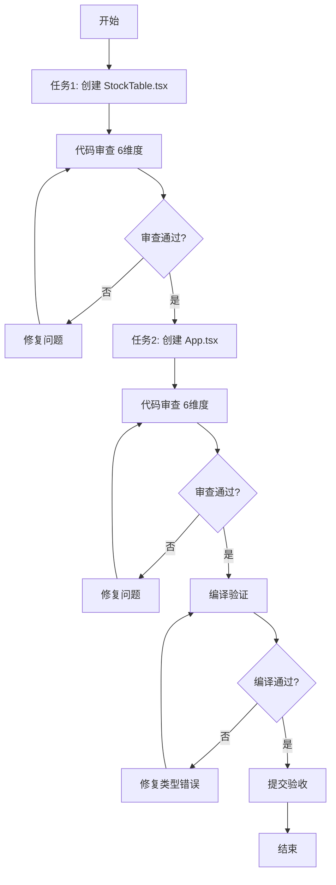

# 前端开发工作计划 - 方舟（前端 AI 工程师）

**负责人**：方舟（前端 AI 工程师）  
**工作目录**：`/Users/zhangk/workspace/Quantitative_trading/frontend`  
**创建日期**：2026-05-31  
**最后更新**：2026-06-04

---

## 📌 当前进度（2026-06-04 更新）

| 阶段 | 状态 | 完成度 |
|------|------|-------|
| Phase 1.3 - 基础组件迁移 | ✅ 完成 | 100% |
| Phase 2 - 巡检问题修复 | ✅ 完成 | 100% |
| Day 2 - K线图组件 | ✅ 完成 | 100% |
| **Day 3 - 形态识别 + 三级缓存** | ✅ 完成 | 100% |
| Day 4 - 待规划 | ⏳ 未开始 | - |

详细工作总结见 [PROJECT_DESIGN.md - Day 3 工作总结](./PROJECT_DESIGN.md#day-3-工作总结2026-06-04)。

---

## 📋 一、任务概述

### 1.1 核心任务
将 `stock_screener/frontend` 的前端组件移植到当前项目，完成 **Phase 1.3：前端基础组件迁移**。

### 1.2 交付物清单
| 序号 | 文件 | 状态 | 说明 |
|------|------|------|------|
| 1 | `src/components/StockTable.tsx` | ⏳ 待创建 | 股票表格组件（约210行） |
| 2 | `src/App.tsx` | ⏳ 待创建 | 主应用组件（约170行） |
| 3 | `src/components/KLineChart.tsx` | 🚫 暂不开发 | Phase 4 任务 |

### 1.3 现有文件（保持不变）
| 文件 | 说明 |
|------|------|
| `src/types.ts` | TypeScript 类型定义（110行） |
| `src/api.ts` | API 接口封装（47行） |
| `src/components/FilterPanel.tsx` | 筛选面板组件（157行） |
| `src/components/StatusBar.tsx` | 状态栏组件（79行） |
| `src/main.tsx` | 应用入口 |
| `src/index.css` | 全局样式 |

---

## 🎯 二、实施原则

### 2.1 严格遵守项目规则
- ✅ **PDCA 循环**：每个任务按 Plan → Do → Check → Action 推进
- ✅ **代码审查**：生成后立即从 6 个维度审查（逻辑、安全、性能、健壮性、可维护性、合规性）
- ✅ **数据范围**：仅处理 A 股主板（60/000开头）和创业板（300开头）
- ✅ **契约先行**：待后端 schemas.py 完成后，同步更新 types.ts
- ✅ **语言规范**：对话、回复和思考全部都用中文

### 2.2 架构约束
- ⛔ **禁止自由推导字段**：所有类型必须来自 types.ts
- ⛔ **禁止跨层调用**：组件 → api.ts → 后端 API
- ⛔ **禁止硬编码**：配置项使用常量或环境变量
- ✅ **单一职责**：每个组件只做一件事

### 2.3 技术规范
- **TypeScript**：严格模式，无 `any` 类型
- **React**：函数式组件 + Hooks
- **样式**：TailwindCSS utility classes
- **状态管理**：useState + useCallback + useEffect
- **性能优化**：合理使用 key、memo、useCallback

---

## 📝 三、详细实施计划

### 3.1 任务分解

#### **任务 1：创建 StockTable.tsx**
**预计耗时**：30 分钟  
**难度**：★★（中）

**功能需求**：
- [ ] 显示股票列表（代码、名称、行业、涨跌幅等12个默认列）
- [ ] 支持展开/收起额外字段（最多25+列）
- [ ] 支持点击列头排序（升序/降序切换）
- [ ] 支持分页（上一页/下一页）
- [ ] 涨跌幅、净流入颜色标记（红涨绿跌）
- [ ] 股票代码可点击跳转到同花顺页面
- [ ] 支持 onRowClick 回调（为后续 K线联动预留）

**技术要点**：
- 使用 `StockRow` 类型定义
- 实现稳定的分页逻辑（offset/limit）
- 排序时隐式追加 `ts_code` 作为第二排序键（后端处理，前端仅传递 sortBy）
- 空值显示为 `-`
- NaN 值在排序时统一置底（后端处理）

**验收标准**：
- [ ] TypeScript 编译无错误
- [ ] 与现有 types.ts 完全兼容
- [ ] 支持至少 100 条数据流畅渲染
- [ ] 分页边界条件正确（第一页禁用"上一页"，最后一页禁用"下一页"）

---

#### **任务 2：创建 App.tsx**
**预计耗时**：30 分钟  
**难度**：★★（中）

**功能需求**：
- [ ] 整合 StatusBar + FilterPanel + StockTable 三大组件
- [ ] 实现筛选条件管理（activeFilters、activeIndustries、activeAreas）
- [ ] 实现排序状态管理（sortBy、sortAsc）
- [ ] 实现分页状态管理（offset）
- [ ] 自动加载元数据（fetchMeta）
- [ ] 根据筛选条件自动刷新股票列表（fetchStocks）
- [ ] 防抖处理：筛选条件变化时取消前一次请求
- [ ] 加载状态提示
- [ ] 错误处理和显示

**技术要点**：
- 使用 useState 管理所有状态
- 使用 useCallback 优化事件处理函数
- 使用 useEffect 处理副作用（数据加载）
- 使用 AbortController 取消过期请求
- LIMIT 设置为 100（符合 ≤200 的要求）

**状态流转图**：
```
用户操作 → 更新状态 → useEffect 触发 → 调用 API → 更新数据 → 重新渲染
     ↑                                                              ↓
     └──────────────────── 用户继续操作 ────────────────────────────┘
```

**验收标准**：
- [ ] TypeScript 编译无错误
- [ ] 与现有组件（FilterPanel、StatusBar、StockTable）无缝集成
- [ ] 筛选、排序、分页功能正常
- [ ] 并发请求正确处理（不会覆盖最新结果）
- [ ] 错误提示友好

---

### 3.2 执行顺序



---

## 🔍 四、代码审查清单

### 4.1 逻辑正确性
- [ ] 排序算法正确（升序/降序切换）
- [ ] 分页计算正确（currentPage、totalPages）
- [ ] 状态更新不会导致死循环
- [ ] useEffect 依赖项完整

### 4.2 安全性
- [ ] 无 dangerouslySetInnerHTML 使用
- [ ] 外部链接使用 `rel="noopener noreferrer"`
- [ ] 无敏感信息硬编码
- [ ] URL 参数正确编码

### 4.3 性能
- [ ] 列表渲染使用唯一 key
- [ ] 事件处理函数使用 useCallback
- [ ] 避免不必要的重渲染
- [ ] 大数据量下滚动流畅

### 4.4 健壮性
- [ ] 空值处理（null/undefined 显示为 `-`）
- [ ] API 调用有 try-catch 或 .catch()
- [ ] 加载状态正确显示
- [ ] 错误状态友好提示

### 4.5 可维护性
- [ ] 变量命名清晰（camelCase）
- [ ] 函数职责单一
- [ ] 关键逻辑有注释
- [ ] 代码结构清晰（导入 → 常量 → 工具函数 → 组件）

### 4.6 合规性
- [ ] 股票代码格式正确（6位数字）
- [ ] limit ≤ 200
- [ ] 无未来函数或前视偏差
- [ ] 符合 A 股数据范围规定

---

## ✅ 五、验收流程

### 5.1 自检清单（开发者完成）
- [ ] 所有代码审查项通过
- [ ] TypeScript 编译无错误
- [ ] 无 ESLint 警告
- [ ] 手动测试基本功能

### 5.2 负责人验收（您完成）
- [ ] 代码 Review 通过
- [ ] 功能演示通过
- [ ] 性能符合要求
- [ ] 符合项目规范

### 5.3 验收通过后
- [ ] 提交 Git  commit
- [ ] 更新任务状态
- [ ] 总结经验教训（Action 阶段）
- [ ] 进入下一个任务

---

## 🚧 六、已知限制与待办事项

### 6.1 当前限制
| 限制项 | 说明 | 解决方案 |
|--------|------|---------|
| **响应信封未完全适配** | api.ts 返回值仍需 null 判空（AbortError 场景） | 已用 try-catch + null 隔离 |
| **后端 meta 接口返回废弃字段** | 8 个字段前端已隐藏（`HIDDEN_FIELD_KEYS`） | 待量量按 [FIX-006](../../docs/AI_COLLABORATION.md) 删除 |
| **后端 parquet 缺 pattern_* 字段** | 前端用 [patternDetector.ts](./src/utils/patternDetector.ts) 自算 | 性能可接受，长期建议后端 ETL 写入 |
| **K线功能偶发 500** | AbortController 已隔离，前端不再 crash | 待量量排查 FastAPI 路由稳定性 |

### 6.2 待办事项（Day 4+ 候选）
| 任务 | 优先级 | 备注 |
|------|--------|------|
| K线图叠加技术指标线（MA/BOLL） | P1 | 指标已算好，需在 KLineChart 加 series |
| 形态识别扩展（剩余 5 个低胜率） | P3 | 按需启用 |
| 后端响应信封统一 | P1 | schemas.py 改造后跟进 |
| 编写组件单元测试 | P2 | vitest |
| 性能优化（虚拟滚动） | P3 | 当前 100 条/页无需 |

---

## 📊 七、进度跟踪

### 7.1 任务状态

| 任务 | 状态 | 完成日期 | 备注 |
|------|------|---------|------|
| StockTable.tsx | ✅ 已完成 | 2026-05-31 | 224 行 |
| App.tsx | ✅ 已完成 | 2026-05-31 | 165 行（持续迭代）|
| Phase 1.3 验收 | ✅ 已完成 | 2026-05-31 | 6 维度审查 |
| Phase 2 巡检修复 | ✅ 已完成 | 2026-06-03 | KDJ/RSI 越界、.env 保护 |
| KLineChart.tsx | ✅ 已完成 | 2026-06-04 | K线 + 成交量叠加 |
| patternDetector.ts | ✅ 已完成 | 2026-06-04 | 5 个高胜率形态 |
| patternCache.ts | ✅ 已完成 | 2026-06-04 | 形态结果按日缓存 |
| klineCache.ts | ✅ 已完成 | 2026-06-04 | LRU 200 只 / 100 天 |
| indicators.ts | ✅ 已完成 | 2026-06-04 | MA/RSI/MACD/BOLL/KDJ |

### 7.2 里程碑
- **M1.3.1-3**：Phase 1.3 完成 ✅
- **M2.1**：巡检问题全部修复 ✅
- **M3.1**：K线图组件上线 ✅
- **M3.2**：形态识别前端自研 + 缓存加速 ✅

---

## 📚 八、参考文档

### 8.1 项目文档
- [量化系统融合开发 - 实施规划方案.md](../../docs/量化系统融合开发%20-%20实施规划方案.md)
- [量化系统融合开发 - 任务总表.md](../../docs/量化系统融合开发%20-%20任务总表.md)
- [project_rules.md](../../.trae/rules/project_rules.md)

### 8.2 源项目参考
- `/Users/zhangk/workspace/stock_screener/frontend/src/components/StockTable.tsx`
- `/Users/zhangk/workspace/stock_screener/frontend/src/App.tsx`

### 8.3 技术文档
- React 官方文档：https://react.dev
- TypeScript 手册：https://www.typescriptlang.org/docs
- TailwindCSS 文档：https://tailwindcss.com/docs

---

## 🔄 九、PDCA 循环记录

### 9.1 Plan（计划）
- ✅ 已完成详细计划制定
- ✅ 已明确任务目标和验收标准
- ✅ 已识别风险和应对措施

### 9.2 Do（实施）
- ✅ 已完成 StockTable.tsx 创建（224行）
- ✅ 已完成 App.tsx 创建（165行）
- ✅ 已完成代码审查（6维度全部通过）
- ✅ 已完成编译验证（TypeScript编译通过）

### 9.3 Check（检查）
- ✅ 已完成功能验收
- ✅ 已完成代码质量检查
- ✅ 已生成验收报告（ACCEPTANCE_REPORT.md）

### 9.4 Action（处理）
- ✅ 已更新 TASK_CHECKLIST.md（完成率100%）
- ✅ 已更新 WORK_PLAN.md（任务状态）
- ✅ 已生成验收报告文档
- ✅ Phase 1.3 正式完成

---

## ✍️ 十、负责人确认

**请在此处签字确认计划**：

- [ ] 我已阅读并理解本计划
- [ ] 我同意按计划执行
- [ ] 我对验收标准无异议
- [ ] 我可以开始执行（回复"同意"或"开始"）

**确认人**：_______________  
**确认日期**：_______________

---

**备注**：如有任何疑问或需要调整的地方，请在开始前提出。计划确认后，我将严格按照此计划执行。
